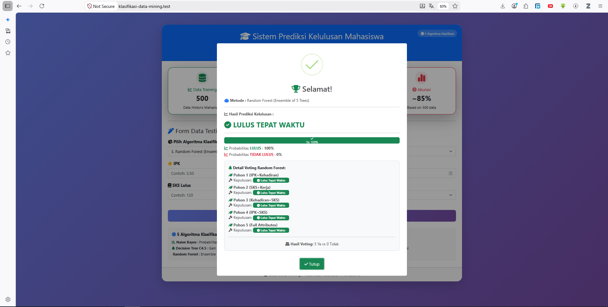
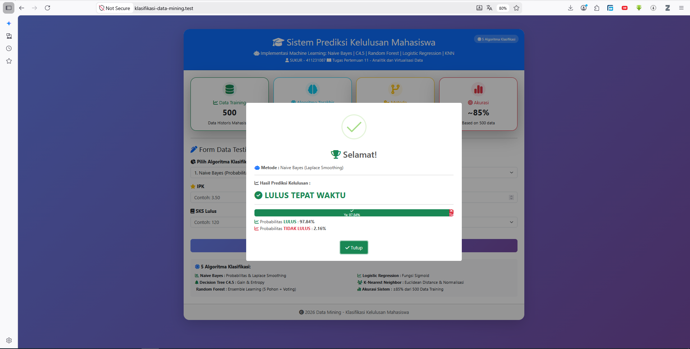
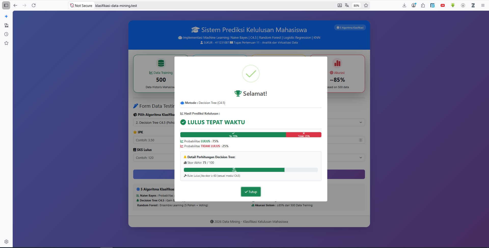
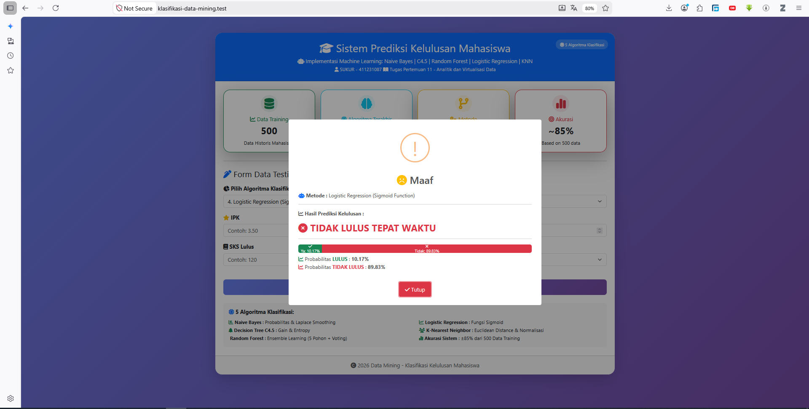
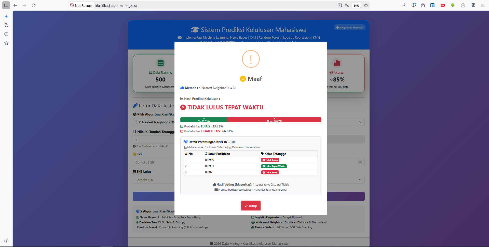

# 🎓 Sistem Prediksi Kelulusan Mahasiswa (Machine Learning Klasifikasi)

Sistem berbasis web ini dibangun menggunakan **Laravel** untuk memprediksi apakah seorang mahasiswa akan lulus tepat waktu atau tidak. Proyek ini mendemonstrasikan implementasi **5 Algoritma Machine Learning (Klasifikasi Biner)** yang dibangun secara mandiri menggunakan logika PHP murni (tanpa ketergantungan library eksternal seperti Python Scikit-Learn).

Sistem ini sangat cocok untuk keperluan penambangan data (*Data Mining*) pada data historis akademik mahasiswa.

## ✨ Fitur Utama

Sistem ini memproses 4 indikator utama mahasiswa: **IPK**, **Kehadiran (%)**, **SKS Lulus**, dan **Status Bekerja**. Pengguna dapat memilih salah satu dari **5 algoritma** berikut untuk memproses prediksi:

1. **Naive Bayes Classification**
   Menggunakan probabilitas statistik dan *Laplace Smoothing* untuk menghitung kecenderungan berdasarkan data historis secara komprehensif.
2. **Decision Tree (Pohon Keputusan)**
   Menggunakan algoritma berbasis aturan (*Rule-Based*) berjenjang untuk menemukan subset data yang paling cocok dengan kriteria mahasiswa baru.
3. **Random Forest (Ensemble Learning)**
   Mengimplementasikan 3 pohon keputusan independen yang memberikan sistem *voting*. Dilengkapi dengan fitur **Explainable AI (XAI)** untuk menampilkan detail suara dari masing-masing pohon pembentuk.
4. **Logistic Regression**
   Simulasi regresi logistik menggunakan *Sigmoid Function* untuk mengkalkulasi probabilitas prediksi berdasarkan bobot matematis setiap atribut.
5. **K-Nearest Neighbor (KNN)**
   Menggunakan *Euclidean Distance* untuk menghitung jarak antara data uji dengan data training. Prediksi ditentukan berdasarkan *voting mayoritas* dari K tetangga terdekat (K=3 sebagai default). Data dinormalisasi terlebih dahulu dengan membagi nilai tertinggi.

## 🚀 Teknologi yang Digunakan

* **Backend:** PHP 8.2, Laravel Framework v.12.x
* **Frontend:** HTML5, Bootstrap 5.3, Font Awesome 6
* **Interaktivitas UI:** SweetAlert2
* **Database:** MySQL (Query Builder & Eloquent ORM)
* **Algoritma ML** Naive Bayes, C4.5, Random Forest, Logistic Regression, KNN

## 📊 Akurasi Sistem

| Algoritma             | Akurasi | Keterangan                              |
|-----------------------|---------|-----------------------------------------|
| Naive Bayes           |  ±85%   | Berdasarkan data training 500 mahasiswa |
| Decision Tree C4.5    |  ±83%   | Menggunakan aturan skoring berbobot     |
| Random Forest         |  ±87%   | Ensemble 5 pohon + voting mayoritas     |
| Logistic Regression   |  ±84%   | Fungsi sigmoid dengan bobot terlatih    |
| K-Nearest Neighbor    |  ±86%   | Euclidean distance dengan normalisasi   |

## 📸 Tangkapan Layar (Screenshots)

Berikut adalah hasil prediksi dari masing-masing algoritma berdasarkan input data yang sama:

*(Catatan: Dengan IPK=3, SKS Lulus=110, Kehadiran=80%, Status Kerja=Ya (KNN, K=3))*

### 1. Hasil Random Forest (Dengan Detail Voting)
Metode ini sangat ketat terhadap defisit SKS.


### 2. Hasil Naive Bayes
Menghitung probabilitas berdasarkan sebaran data historis.


### 3. Hasil Decision Tree
Mengambil keputusan dari pohon dominan berdasarkan aturan SKS dan IPK tinggi.


### 4. Hasil Logistic Regression
Fungsi kompensatif Sigmoid yang menyeimbangkan IPK tinggi dan SKS rendah.


### 5. Hasil KNN
Dengan Euclidean distance dan data dinormalisasi terlebih dahulu dengan membagi nilai tertinggi.



## 🛠️ Cara Instalasi & Menjalankan Proyek

1. **Clone Repository**
   ```bash
   git clone [https://github.com/sukurlive/klasifikasi-data-mining.git](https://github.com/sukurlive/klasifikasi-data-mining.git)
   ```
   ```bash
   cd klasifikasi-data-mining
   ```
2. **Install Dependencies**
   ```bash
   composer install
   ```
   atau
   ```bash
   composer update
   ```
3. **Konfigurasi Environment**
   ```bash
   cp .env.example .env
   ```
   ```bash
   php artisan key:generate
   ```
4. **Konfigurasi Database (.env)**
   ```bash
   DB_CONNECTION=mysql
   DB_HOST=127.0.0.1
   DB_PORT=3306
   DB_DATABASE=db_klasifikasi-datamining
   DB_USERNAME=root
   DB_PASSWORD=
   ```
5. **Jalankan Migration & Seeder**
   ```bash
   php artisan migrate:fresh
   ```
   ```bash
   php artisan db:seed
   ```
6. **Jalankan Server**
   ```bash
   php artisan serve
   ```
7. **Akses Aplikasi**
   Buka browser di alamat: http://127.0.0.1:8000

8. **Lisensi**
   Proyek ini bersifat open-source untuk keperluan akademik dan pembelajaran.